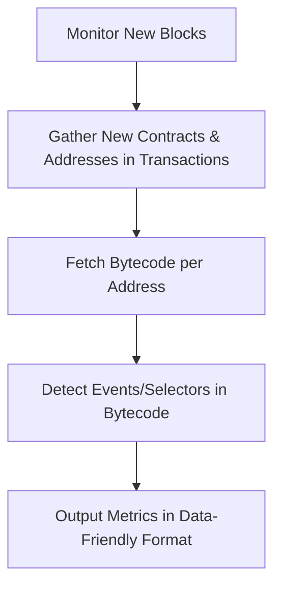
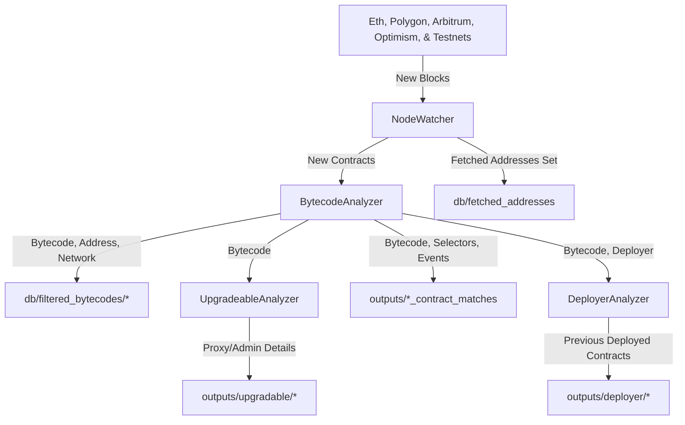

# Fetching Backend

## How to use
Fill out .env_template and rename to .env
```
cargo run --release
```

## Methodology


```mermaid
graph
    A[Monitor New Blocks] --> B[Gather New Contracts & Addresses in Transactions]
    B --> C[Fetch Bytecode per Address]
    C --> D[Detect Events/Selectors in Bytecode]
    D --> E[Output Metrics in Data-Friendly Format]
```

## Architecture


```mermaid
graph
    J[Eth, Polygon, Arbitrum, Optimism, & Testnets] -->|New Blocks| A[NodeWatcher]
    A[NodeWatcher] -->|New Contracts| B[BytecodeAnalyzer]
    A[NodeWatcher] -->|Fetched Addresses Set| C[db/fetched_addresses]
    B -->|Bytecode, Address, Network| F[db/filtered_bytecodes/*]
    B -->|Bytecode| E[UpgradeableAnalyzer]
    B -->|Bytecode, Selectors, Events| H[outputs/*_contract_matches]
    E -->|Proxy/Admin Details| G[outputs/upgradable/*]
    B -->|Bytecode, Deployer| D[DeployerAnalyzer]
    D -->|Previous Deployed Contracts| I[outputs/deployer/*]
```